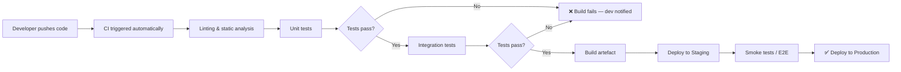

# CI/CD — Continuous Integration & Continuous Deployment

## A bit of context

At some point most dev teams hit the same wall. You've been working heads-down for a week, you open a PR, and suddenly you're spending your Friday afternoon untangling conflicts you didn't even know existed. Something breaks in staging, nobody's sure what caused it, and the release gets pushed again.

CI/CD is the answer to that specific kind of misery. The core idea — merge small, test automatically, deploy often — sounds almost too simple, but the execution is where teams tend to fall apart.

Martin Fowler's original article on this is still worth reading even though it's old:

> *"The key test is that you should be able to start from scratch on a new machine, check out the project, and be fully able to build and test with a single command."*
> — [Continuous Integration, martinfowler.com](https://martinfowler.com/articles/continuousIntegration.html)

One figure that keeps coming up in industry reports: around 70% of engineering teams say they practice CI/CD. Only about 24% can actually deploy on demand. The difference is usually not the tooling — it's the habits around it.

---

## What the pipeline looks like

The target is under 10 minutes, start to finish. That's not arbitrary — it's the threshold past which developers stop waiting for results and start merging anyway. Once that happens the pipeline is just decorative.
---

## What actually works

Push code often, in small pieces. Not when a feature is complete. Not at end of week. Regularly, ideally daily. Big branches feel productive right up until the point you try to merge them, and then they're a disaster. A week of divergence means a week of conflicts. Smaller commits keep everyone in sync and make each individual merge nearly painless. ([Fowler](https://martinfowler.com/articles/continuousIntegration.html))

When the build breaks, stop everything and fix it. This sounds obvious but it's surprisingly hard to enforce culturally. The temptation is to say "I'll get to it after this other thing" — and then six hours later the build is still red and half the team is blocked. A broken build left sitting is more damaging than the original bug, because it teaches people that red is normal.

Structure the pipeline so cheap checks come first. Linting before unit tests, unit tests before integration tests, integration tests before E2E. There's genuinely no reason to wait 25 minutes for a full test suite to tell you about a missing import. ([DEV Community](https://dev.to/_d7eb1c1703182e3ce1782/best-cicd-pipeline-for-small-teams-a-practical-2026-guide-2ad0))

No PR merges without passing CI. Enforce this through branch protection rules, not trust. "Works on my machine" is a joke, not a justification.

For anything that feels risky to deploy, use a feature flag. Ship the code, keep the feature hidden, and enable it when you're ready. If something goes wrong you flip the flag off — no rollback, no hotfix branch, no emergency meeting at midnight. It also means you can separate the technical act of deploying from the product decision of releasing, which turns out to be surprisingly useful. ([Medium](https://medium.com/@bhuwanmishra_59371/ci-cd-best-practices-lessons-learned-from-real-world-projects-6b51add94d73))

Automate every step of the deployment. Every single one. If there's one manual step — one checkbox, one SSH command, one script someone keeps on their laptop — that step will fail eventually, and it will fail at the worst possible time. The teams that are confident about deploying are the ones where nobody has to do anything by hand.

Before you deploy, know how you'd undo it. Previous image, migration reversal, feature toggle — the mechanism matters less than having agreed on one in advance, before things go wrong.

Flaky tests deserve their own paragraph because this one is insidious. A test that fails 15% of the time isn't just annoying — it trains developers to click "re-run" without looking at the output. After a few weeks of that, a real failure looks identical to the background noise and gets ignored. Atlassian wrote about this problem in detail after dealing with it themselves; their conclusion was to quarantine flaky tests immediately and treat fixing them as actual work, not optional cleanup. ([Atlassian Engineering](https://www.atlassian.com/blog/atlassian-engineering/taming-test-flakiness-how-we-built-a-scalable-tool-to-detect-and-manage-flaky-tests))

---

## Things to actively avoid

Pipelines that run forever. It's almost a rite of passage — every team at some point ends up with a pipeline that takes 40, 50, sometimes 60 minutes to complete. By that point nobody's waiting for it. They merge, they push, they deal with production issues later. If your pipeline is slow, splitting it into parallel stages and failing fast on the cheapest checks first will help more than any other single change.

Secrets in version control. This still happens constantly. Someone pushes an API key "just temporarily" and it ends up in the git history permanently, even after deletion. GitHub Secrets, environment variables, a secrets manager — doesn't matter which, just not hardcoded in a YAML file. ([EM360Tech](https://em360tech.com/tech-articles/cicd-anti-patterns-whats-slowing-down-your-pipeline))

The permanently red build. Once a team gets used to the pipeline always being broken, it stops being useful as a signal. Everything looks the same whether there's a real problem or not. Red should mean something.

Staging environments that don't match production. Tests that pass on a stripped-down local setup and fail in prod give you false confidence, which might actually be worse than having no tests at all. It's worth the effort to keep staging representative.

Infrequent, large releases. There's a psychological pull toward big releases — they feel like events, like progress. But shipping two weeks of work at once is two weeks of accumulated risk hitting production simultaneously. The teams that sleep well at night ship boring, small updates constantly and never have a "big release" at all.

---

## References

1. Martin Fowler — [Continuous Integration](https://martinfowler.com/articles/continuousIntegration.html). Written in 2001, updated 2006. One of those pieces that's aged well.

2. Bhuwan Mishra — [CI/CD Best Practices: Lessons Learned from Real-World Projects](https://medium.com/@bhuwanmishra_59371/ci-cd-best-practices-lessons-learned-from-real-world-projects-6b51add94d73). A practitioner writing about what breaks in practice. More useful than most theoretical guides.

3. EM360Tech — [CI/CD Anti-Patterns: What's Slowing Down Your Pipeline?](https://em360tech.com/tech-articles/cicd-anti-patterns-whats-slowing-down-your-pipeline). Good catalogue of recurring mistakes.

4. DEV Community — [Best CI/CD Pipeline for Small Teams, 2026](https://dev.to/_d7eb1c1703182e3ce1782/best-cicd-pipeline-for-small-teams-a-practical-2026-guide-2ad0). Aimed at teams our size, starting from scratch with GitHub Actions.

5. Atlassian Engineering — [Taming Test Flakiness](https://www.atlassian.com/blog/atlassian-engineering/taming-test-flakiness-how-we-built-a-scalable-tool-to-detect-and-manage-flaky-tests). Atlassian's engineering blog post on how they built internal tooling to manage flaky tests — honest about how badly it can get before you address it.

---

*Written by Hugo Denis — Antonin Miranda contributed the tooling examples and comparison table*
